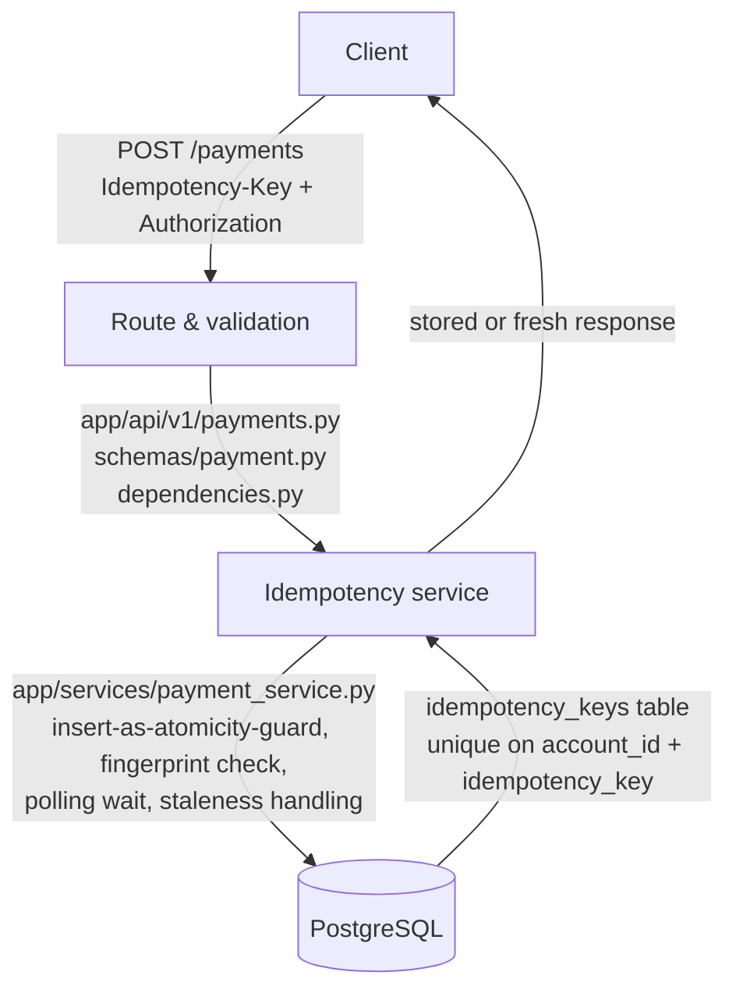

# Idempotent Ingestion Engine


A FastAPI payment-ingestion service that guarantees a client is never double-charged — even under network retries, concurrent duplicate requests, or a mid-flight server crash.

This project isn't a payment processor. It doesn't move real money, and it deliberately doesn't talk to Stripe, Adyen, or any real PSP. Its scope is narrower and more specific: **safely accepting the intent to charge someone, exactly once, under every failure mode that can realistically hit a production payment API.**

## Contents

- [Why this exists](#why-this-exists)
- [Architecture](#architecture)
- [Tech stack](#tech-stack)
- [Design decisions](#design-decisions)
- [Bugs found and fixed during development](#bugs-found-and-fixed-during-development)
- [Getting started](#getting-started)
- [API](#api)
- [Testing](#testing)
- [Scope and limitations](#scope-and-limitations)
- [About](#about)

## Why this exists

Most idempotency implementations stop at "check if a key exists before processing." That approach breaks under concurrency — two requests can both pass the check before either has written anything. This project was built to go past that naive version and handle the failure modes that actually show up in production payment systems:

- **The classic race condition** — two identical requests arriving within microseconds of each other, both attempting to process before either commits.
- **Key reuse with a different payload** — the same idempotency key sent with a genuinely different request body, which should be rejected, not silently processed.
- **A request that's still legitimately in-flight** — a concurrent duplicate arriving while the original request is actively being processed (e.g. mid-PSP-call), which should wait for the real result rather than error or double-process.
- **An orphaned request** — the server crashes between accepting a charge and finishing it, leaving a stuck record that must eventually be recognized as abandoned, not polled forever or silently reprocessed (which would risk a double charge).

Every one of these was found, reasoned through, and fixed during development — several as real bugs caught during design review, not hypothetical edge cases. See [Bugs found and fixed](#bugs-found-and-fixed-during-development) below.

## Architecture



`account_id` is derived server-side from the auth token at the "Route & validation" stage — it is never accepted from the client, anywhere in the request.

## Tech stack

- **FastAPI** — HTTP layer, request validation
- **PostgreSQL** — durable state, and the actual mechanism enforcing exactly-once processing (a database-level unique constraint, not application-level locking)
- **SQLAlchemy + Alembic** — ORM and migrations
- **pytest** — unit and concurrency test suites, the latter using real `threading` (not mocked/sequential calls) to genuinely exercise race conditions against a live Postgres instance

## Design decisions

A few choices worth knowing the reasoning behind, since they're the parts that separate this from a naive idempotency implementation:

| Decision | Why |
|---|---|
| The `INSERT` itself is the concurrency guard | Not a `SELECT`-then-write check, which has a race window. Postgres's unique constraint on `(account_id, idempotency_key)` guarantees exactly one of two simultaneous inserts succeeds. |
| Uniqueness scoped per-account, not global | An idempotency key is a claim one account makes about one action — not a system-wide identifier. Two unrelated accounts choosing the same key string should never interfere with each other. |
| A request fingerprint (hash) detects payload reuse | Separate mechanism from the uniqueness constraint — two different failure modes (a race vs. a mismatched retry) need two different checks. |
| Two-commit design (insert "processing," then commit "completed") | Avoids holding a database lock across the slow part of the work (simulating/calling a PSP). Holding a transaction open across external network I/O risks connection pool exhaustion and cascading lock contention under load. |
| Polling instead of row-level locking for an in-flight wait | An earlier design used `SELECT ... FOR UPDATE` — but the two-commit design above releases the lock before the slow work even starts, so there's nothing left to block on during the window that matters. Polling with a bounded staleness timeout is the correct mechanism. |
| A stale "processing" row is never silently reprocessed | If the original request crashed before finishing, the safe response is "retry with a *new* idempotency key" — reprocessing risks a double charge if the original attempt actually succeeded downstream before crashing. |
| `DECIMAL`, not `float`, for amounts | Binary floating point can't represent most decimal fractions exactly — errors compound across volume. Currency-aware decimal precision (not a blanket assumption) is used when normalizing for the fingerprint hash, since not every currency uses 2 decimal places (JPY: 0, KWD: 3). |

## Bugs found and fixed during development

Caught during design review and fixed before shipping — kept here deliberately, because reasoning through these is a more honest signal of engineering judgment than a README that implies everything worked on the first pass.

| Bug | Root cause | Fix |
|---|---|---|
| Two-commit design silently made the lock-wait mechanism unreachable | A `SELECT ... FOR UPDATE` wait relied on a lock that was, by design, already released by the time a concurrent duplicate could observe it | Replaced with a time-bounded polling loop against the row's own state |
| Fingerprint mismatch on functionally identical retries | `Decimal("10.00")` and `Decimal("10.0")` stringify differently, producing different hashes for the same value | Currency-aware quantization of the amount before hashing |
| A per-waiter staleness clock could give a late-arriving request a fresh grace period | Staleness was briefly measured from when *a given request* started waiting, not from the row's actual age | Staleness derived from the row's own `updated_at`, so every observer agrees on how old it is |
| Idle-in-transaction connections during polling | A naive `expire_all()`-based fix would have refreshed cached state but left the DB transaction open for the full polling duration | Each poll iteration commits (closing the transaction) as well as expiring cached state |

## Getting started

**Requirements:** Python 3.12+, Docker

```bash
# Start Postgres
docker compose up -d

# Install dependencies
pip install -e ".[dev]"

# Run migrations
alembic upgrade head

# Start the server
uvicorn app.main:app --reload
```

Copy `.env.example` to `.env` and set `DATABASE_URL` to match your Postgres container before running the app.

## API

**`POST /payments`**

| | |
|---|---|
| **Headers** | `Authorization: Bearer <token>`, `Idempotency-Key: <UUID>` (required) |
| **Body** | `amount` (decimal, > 0), `currency` (ISO 4217 code), `payment_method` (`card` \| `bank_transfer` \| `wallet`), `reference` (structured identifier, e.g. an order ID) |
| **Response** | `201` with `payment_id`, `status`, `amount`, `currency`, `reference`, `created_at` |

`account_id` is never accepted from the client — it's derived server-side from the auth token, to avoid a client being able to act on another account's behalf.

## Testing

```bash
# Unit + integration tests
pytest tests/unit tests/integration -v

# Concurrency suite — fires genuinely simultaneous requests via threading.Barrier
# against a live Postgres instance to prove the race conditions are actually handled
pytest tests/concurrency -v
```

<details>
<summary><strong>Manually verifying the core guarantees (click to expand)</strong></summary>

These scenarios were manually verified end-to-end during development, not just covered by automated tests:

1. **Happy path** — a normal request returns `201` with a `payment_id`, and the row lands in `idempotency_keys` with `status = completed`.
2. **Duplicate replay** — resending the identical request (same key, same body) returns `201` with the *identical* `payment_id` as the original — proof it replayed the stored result rather than processing a second charge.
3. **Fingerprint mismatch** — reusing a key with a *different* body (e.g. a different amount) returns `409`, and the mismatch is logged server-side.
4. **Stale/abandoned row** — a `"processing"` row with no owning request left (simulating a mid-flight crash) is rejected with `409` once past the staleness threshold, telling the client to retry with a new key — never silently reprocessed.
5. **Concurrent race** — `pytest tests/concurrency -v`, specifically `test_simultaneous_identical_requests_return_same_payment_id`, proves that of two genuinely simultaneous identical requests, exactly one processes and both receive the same `payment_id`.

</details>

## Scope and limitations

This project deliberately does not include:
- Real PSP integration (Stripe/Adyen/etc.) — charge simulation is instant and always succeeds
- PSP routing/failover logic (a separate project in this portfolio)
- Account/merchant identity management — `account_id` is treated as an opaque, externally-managed reference
- A ledger — this project handles safe *ingestion*, not the durable accounting record of what happened (see the companion Double-Entry Ledger project)

## About

Built as part of interview preparation for senior backend / card-wallet engineering roles, with a focus on demonstrating the failure-mode reasoning and system design trade-offs that distinguish senior scope from a working CRUD API.